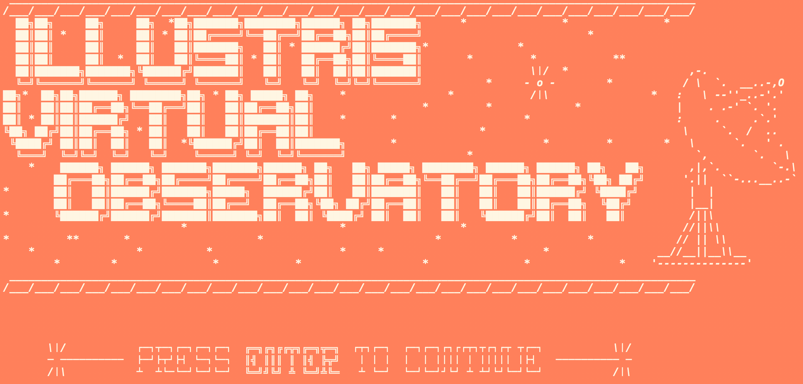
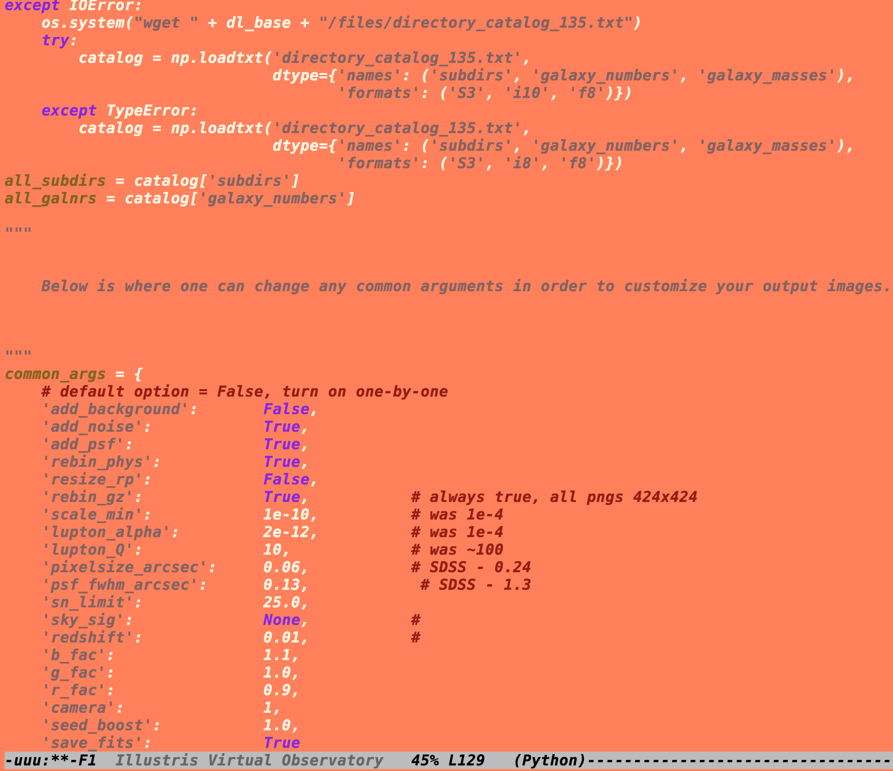

 
<video src="ivo.mp4" width="640" height="410" controls preload></video>

 

*   A command line program for creating synthetic observations of galaxies from [Illustris](http://www.illustris-project.org/).

*   Create mock observations from Hubble Space Telescope or Sloan Digital Sky Survey.

*   Customize parameters like redshift, camera, filter etc...

>_This program was created by updating, compiling, and modifying the [Sunpy Module](http://www.github.com/ptorrey/sunpy/) by Dr. Torrey & Dr. Snyder._
>_Unix/MacOS/Linux requirement_
* * *

# Installation

>Dependencies required: numpy, matplotlib, astropy, cosmocalc, scipy, gc, and wget.

## Downloading the repository

Clicking the 'Download .zip' or 'Download .tar.gz' will download a complete directory of files. However, this program has many dependencies, so the file called '**setup**' should be run first. The file is written in bash and can be modified in a text editor before execution if manual dependency setup is preferred.

This will download any dependency that the program requires as well as open up a webpage to the [Illustris Galaxy Observatory-](http://www.illustris-project.org/galaxy_obs/) where mock galaxies from the Illustris simulation can be viewed.

## Choose A Sample

Use the search tool and narrow your catalog by varying mass limit contributions.

>Search tools include: stellar mass limits, black hole mass limits, gas mass limits, and total mass limits.

### Identify the galaxy ID

The **ID** for a given galaxy can be found to the left of its image. This **ID** will later be used to specify which galaxy you'd like for simulated observations.

Once the **ID** number to the corresponding galaxy is found, make sure to save it somewhere for later!

* * *

# Running the program
> Make sure you've run the **setup** file and have all required dependencies installed...

Run the program titled **Illustris Virtual Observatory**- this should open up the following terminal window:

If the program doesn't execute, first see if the shebang (#!/bin/usr/env python) (_on the first line_) is correct for your installation of Python. If you use anaconda or microconda, the shebang may have to be edited to point to the correct build of Python.

Follow the program and enter your chosen galaxy **ID** when prompted. If everything is working correctly, you should be given a choice:

1.                                      **Hubble Space Telescope** (option 1)

2.                                     **Sloan Digital Sky Survey** (option 2)

Based on your choice, the images produced will be convolved to the respective pixel-scaling/resolution.

After selecting an instrument, the program should inform you when it has finished (_and if it was successful_).

>Note: backgrounds are currently only available for SDSS. Basics on modifying the code are included in the next section.

The images you produced should now exist in the same directory that the program is in. **Illustris Virtual Observatory** should output .png and .fits files containing your observations.

# Changing the program

The program file "**Illustris Virtual Observatory**" is a Unix executable- but it is written in Python 3. This means you can simply open the file in a text editor and modify the script to your liking.

Here, you can completely customize the output. Changing the redshift on this page will make the image convolve to the corresponding value once the program is run. The file can also be modified to include multiple outputs, backgrounds, etc...

For more on modification, refer to the Sunpy module (source code).

> Tyler Metivier, Whitaker Research Group, University of Connecticut

> funded by NASA CT Space Grant Consortium through an Undergraduate Research Fellowship Grant
