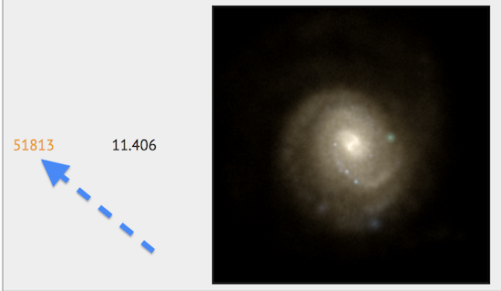
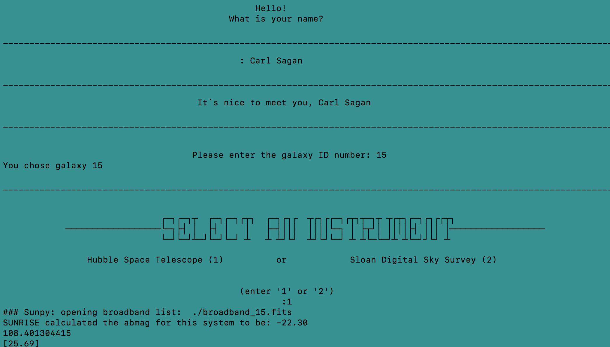

*   A command line program for creating synthetic observations of galaxies from [Illustris](http://www.illustris-project.org/).
*   Create mock observations from Hubble Space Telescope or Sloan Digital Sky Survey.
*   Customize parameters like redshift, camera, filter etc...
>_This program was created by updating, compiling, and modifying the [Sunpy Module](http://www.github.com/ptorrey/sunpy/) by Dr. Torrey & Dr. Snyder._

* * *

# Installation

>Dependencies required: numpy, matplotlib, astropy, cosmocalc, scipy, gc, and wget.

## Download the repository

After downloading the files and saving them to your working directory, we can first run the program called **setup**.  

This will download any dependency that the program requires as well as open up a webpage to the [Illustris Galaxy Observatory-](http://www.illustris-project.org/galaxy_obs/) where mock galaxies from the Illustris simulation can be viewed. 

## Choose A Sample

Use the search tool and narrow your catalog by varying mass limit contributions. 

>Search tools include: stellar mass limits, black hole mass limits, gas mass limits, and total mass limits.

### Identify the galaxy ID

The **ID** for a given galaxy can be found to the left of its image. This **ID** will later be used to specify which galaxy you'd like for simulated observations. 

Once the **ID** number to the corresponding galaxy is found, make sure to save it somewhere for later! 

* * * 

# Running the program
> Make sure you've run the **setup** file and have all required dependencies installed...

Run the program titled **Illustris Virtual Observatory**- this should open up the following terminal window:

Follow the program and enter your chosen galaxy **ID** when prompted. If everything is working correctly, you should be given a choice:
1. **Hubble Space Telescope** (_option 1_)
2. **Sloan Digital Sky Survey** (_option 2_)

Based on your choice, the images produced will be convolved to the respective pixel-scaling/resolution. 

After selecting an instrument, the program should inform you when it has finished (_and if it was successful_). 

